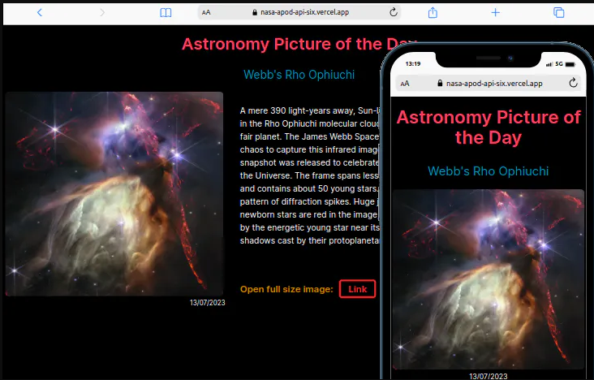

# Foto Astronômica do Dia

Este é um projeto pessoal que utiliza a API da NASA para fazer requisições à API APOD (Astronomy Picture of the Day), a fim de mostrar informações e a imagem astronômica do dia.

## Funcionalidades

- **Renderização da Foto Astronômica:** O projeto faz uso da API da NASA para buscar a foto astronômica mais recente do dia e a exibe na interface.
- **Exibição de Informações:** Além da imagem, o projeto também mostra informações relacionadas à fotografia, como título, data e descrição.

## Tecnologias Utilizadas

- **Next.js**: Framework React utilizado para a construção da aplicação.
- **TypeScript**: Adiciona tipagem estática ao JavaScript, aumentando a robustez e a manutenibilidade do código.
- **Tailwind CSS**: Framework de CSS utilizado para estilização dos componentes, proporcionando uma experiência de desenvolvimento mais rápida e consistente.
- **API da NASA (APOD)**: Utilizada para obter a fotografia astronômica do dia e suas informações associadas.

## Como Executar

1. Clone o repositório do projeto:

```bash
git clone https://github.com/seu-usuario/foto-astronomica-do-dia.git
Navegue até o diretório do projeto:
bash
Copy code
cd foto-astronomica-do-dia
Instale as dependências:
bash
Copy code
npm install
# ou
yarn install
Inicie o servidor de desenvolvimento:
bash
Copy code
npm run dev
# ou
yarn dev
Acesse a aplicação em seu navegador através do endereço http://localhost:3000.
Contribuição
Contribuições são bem-vindas! Sinta-se à vontade para enviar pull requests ou abrir issues para reportar bugs ou sugerir novas funcionalidades.

Licença
Este projeto está licenciado sob a MIT License.
